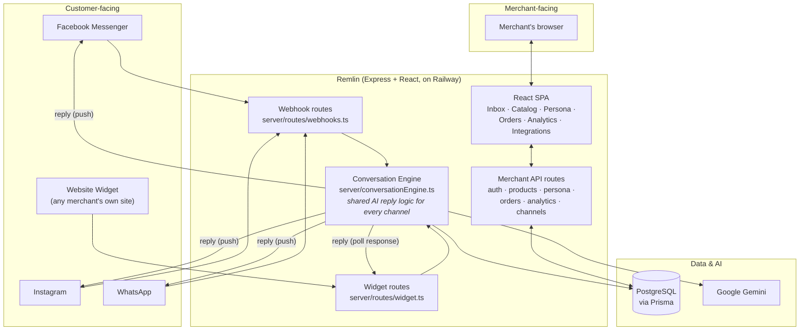
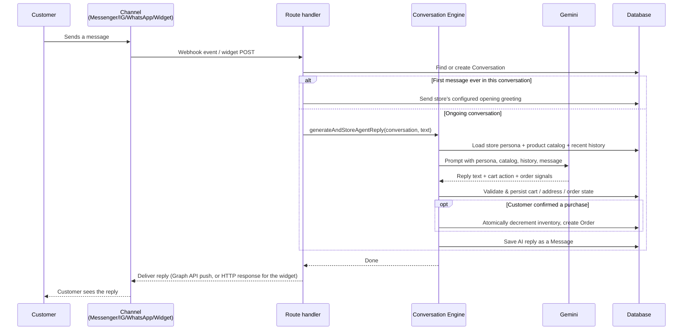
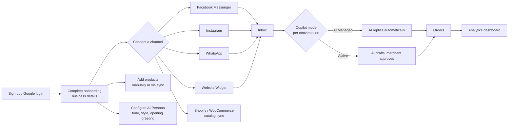

# Remlin

An AI sales agent for merchants — connects to Messenger, Instagram, WhatsApp, and a
website chat widget, answers customers using a real product catalog, and manages
carts and orders end to end. Built as a CSE499 capstone project.

## Live Site

The deployed app is live on Railway: [remlin.up.railway.app](https://remlin.up.railway.app)

Demo login: `merchant@shopmate.ai` / `password1234`

## Tech Stack

- **Frontend:** React + TypeScript, Vite, Tailwind CSS
- **Backend:** Node.js + Express, TypeScript
- **Database:** PostgreSQL (Supabase) via Prisma ORM
- **AI:** Google Gemini
- **Hosting:** Railway

## What It Does

A merchant signs up, connects one or more sales channels (Facebook Messenger,
Instagram, WhatsApp, or a chat widget embedded on their own website), uploads a
product catalog, and configures an AI persona (tone, style, custom instructions,
opening greeting). From then on, every customer message on any connected channel is
answered by Gemini using that store's real catalog and persona — the same reply
engine handles all four channels identically, with only the final "send it out"
step differing per channel. The AI can build a cart, extract a shipping address, and
either hand a draft to the merchant for approval or auto-finalize a real order,
depending on the store's Copilot settings.

## Architecture

Every route lives in its own file under `server/routes/` (auth, profile, products,
orders, persona, conversations, channels, analytics, legal, webhooks, widget) — see
[`docs/CO2_Design_Report_ShopMate_AI.pdf`](./docs/) for the full design rationale.
The AI reply pipeline itself is channel-agnostic: `generateAndStoreAgentReply()` in
`server/conversationEngine.ts` doesn't know or care whether it's replying to a
Messenger PSID, an Instagram user, a WhatsApp number, or an anonymous website
visitor — channel-specific code only exists in the last step, delivering the reply
back out.

## App Flow — how one customer message gets answered

If the merchant has **Copilot** off for that conversation, the AI's reply is saved
as a *pending draft* instead of being sent — the merchant reviews and approves it
from the Inbox before the customer ever sees it.

## User Flow — merchant journey

## Local Development

**Prerequisites:** Node.js

1. Install dependencies:
   `npm install`
2. Copy `.env.example` to `.env` and fill in the required values.
3. Run the app:
   `npm run dev`

## Documentation

Project docs live in [`docs/`](./docs/) — architecture notes, the AI agent's
order-management rules, the UI design spec, per-channel setup guides (Shopify,
WooCommerce, WhatsApp, Facebook), and the capstone course-outcome submission
documents.

## License

MIT — see [LICENSE](./LICENSE).
