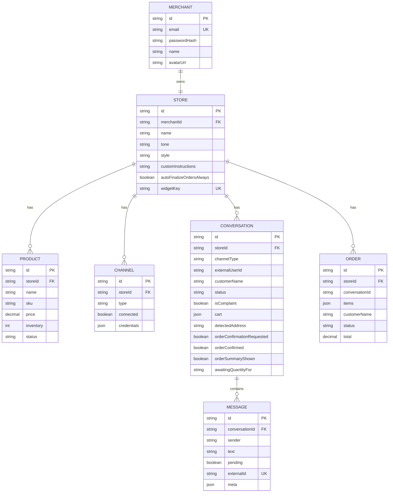
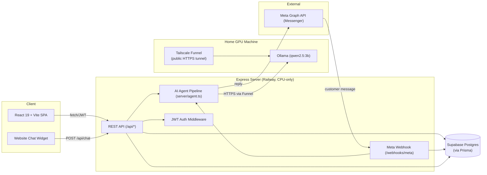
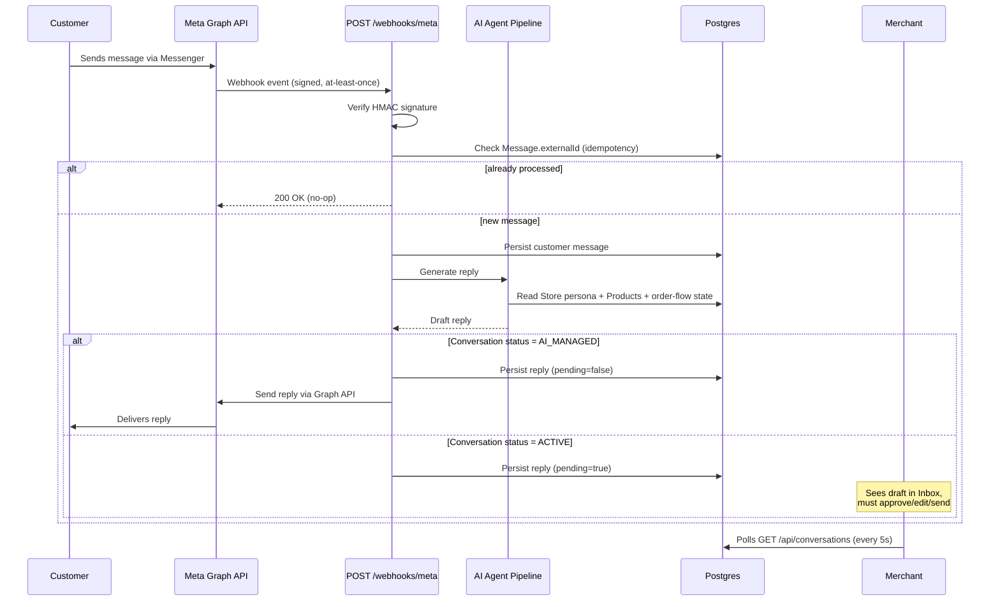
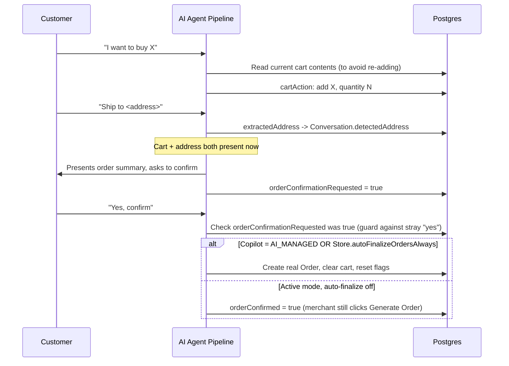

# ShopMate AI — Revision Document

_Last updated: 2026-07-31_

A snapshot of the tech stack, what's been built so far, the database schema, and system diagrams — for capstone revision/reporting purposes. For day-to-day working notes see `CLAUDE.md`; for the original roadmap see `PLANNING.md`; for a dated plain-language history see `CHANGELOG.md`.

---

## 1. Tech Stack

| Layer | Technology |
|---|---|
| Frontend | React 19 + TypeScript, Vite 6, Tailwind CSS 4 |
| UI extras | `lucide-react` (icons), `motion` (animation), `recharts` (analytics charts) |
| Backend | Node.js + Express 4, TypeScript (`tsx` in dev, bundled with `esbuild` for prod) |
| Database | Supabase Postgres (`ap-northeast-2`), accessed via **Prisma ORM 6** |
| Auth | JWT (`jsonwebtoken`) + `bcryptjs` password hashing |
| AI | Self-hosted **Ollama** (`qwen2.5:3b`), reached over HTTP via `server/ollama.ts`. Replaced Google Gemini to remove per-request API cost/dependency. Runs on a GPU machine, exposed to production via a **Tailscale Funnel** tunnel (public HTTPS → `localhost:11434`), since Railway's hosting has no GPU. |
| Messaging channel | Facebook Messenger via Meta Graph API — real self-serve OAuth connect flow (primary) plus a manual Page Access Token fallback path |
| Hosting | Railway (deployed via `railway up` CLI, not GitHub-integration) |

**Repo layout**

```
server.ts          Express app, all API + webhook routes
server/agent.ts     Shared AI reply pipeline (widget + Messenger)
server/auth.ts       JWT/password helpers
server/db.ts         Prisma client singleton
server/ollama.ts     Ollama API wrapper (chat + warm-up)
server/meta.ts       Meta Graph API helpers (send message, profile lookup, signature verify, OAuth)
server/crypto.ts     AES-256-GCM encryption for stored channel tokens
prisma/schema.prisma Database schema
prisma/seed.ts       Demo/seed data loader
src/                 React frontend (components, lib/api.ts client, types.ts)
```

---

## 2. What's Been Built

The project started as a static, AI-Studio-generated frontend demo running entirely on fake in-memory data. It's being rebuilt feature-by-feature into a real product.

### ✅ Done — real, database-backed

- **Auth** — signup/login/JWT against `Merchant`/`Store`, bcrypt-hashed passwords, `GET/PATCH /api/me` (name, email, avatar, password change with current-password verification).
- **Product Catalog** — `GET/POST /api/products`, `DELETE /api/products/:id`, scoped to the merchant's store, duplicate SKUs rejected (409).
- **AI Persona** — `GET/PUT /api/persona`, backed by `Store.tone/style/customInstructions`, plus an "Order Auto-Finalization" toggle (`Store.autoFinalizeOrdersAlways`, see below).
- **Inbox / Conversations** — `GET /api/conversations`, `PATCH /api/conversations/:id` (status), `POST /api/conversations/:id/messages` (merchant reply or simulated customer message), `POST .../messages/:id/approve` (approve an AI-drafted reply). Polls every 5s for new messages. Only shows conversations for channels that are actually connected (`connectedPlatforms` gating).
- **AI Copilot toggle** — **AI Managed** = full autopilot (AI drafts and auto-sends). **Active** = AI drafts a reply held as `Message.pending`, merchant must approve/edit before it reaches the real customer.
- **Facebook Messenger channel** — real webhook at `POST /webhooks/meta`, HMAC-signature verified via `META_APP_SECRET`. Incoming message → shared AI pipeline (`server/agent.ts`) → reply persisted → delivered via Graph API Send API. Idempotent against Meta's at-least-once webhook delivery (`Message.externalId` unique constraint). Real customer names fetched via Graph API profile lookup.
- **Self-serve Facebook OAuth connect** — real "Connect with Facebook" flow (`GET /api/channels/facebook/connect` → OAuth → optional multi-Page picker → encrypted per-store token in `Channel.credentials`, webhook auto-subscribed via the Graph API). The old manual-token fallback (`META_PAGE_ACCESS_TOKEN`) has been removed — Messenger only works through a genuinely completed OAuth connection now.
- **Notifications** — `GET /api/notifications`, derived from real data (unread customer messages, complaints, low-stock products) instead of a hardcoded fake list.
- **Navigation** — browser back/forward wired to in-app tab state via the History API.
- **Real carts and orders** — the AI's `cartAction` builds `Conversation.cart` (validated against real stock); "Generate Order" creates a real `Order` row as a manual merchant action; an Orders screen lists/updates them.
- **Shipping address auto-detection** — the AI extracts a shipping address from the conversation (`Conversation.detectedAddress`) and pre-fills the Generate Order form.
- **Admin-independent order confirmation** — once a conversation has both a cart and an address, the AI presents a summary and asks the customer to confirm; an explicit "yes" auto-finalizes a real `Order` with no merchant click needed, gated by Copilot mode plus the `autoFinalizeOrdersAlways` persona setting.
- **Integrations Hub** — real connect/disconnect for Facebook (shows the connected Page's name); other channel cards are still mock.

### ❌ Not yet wired to the database (still mock/local state)

- **Analytics Dashboard** — still mock data.
- **Instagram/WhatsApp/Shopify/WooCommerce** — mock toggles; Instagram messaging is technically reachable through the same Facebook Login token scopes but isn't wired up.
- **Forgot password** — intentionally disabled ("not available yet") rather than wired for real; the original demo behavior let anyone reset any account's password by typing an email, which would be a real account-takeover hole on the public URL.
- **Archive/Spam filter tabs** in the Inbox — non-functional, would need schema additions.

---

## 3. Database Schema (Prisma / Postgres)

```prisma
enum ProductStatus      { PENDING, TRAINED }
enum ChannelType         { FACEBOOK, INSTAGRAM, WHATSAPP, WIDGET }
enum ConversationStatus  { AI_MANAGED, ACTIVE, CLOSED }
enum Sender               { CUSTOMER, AI, MERCHANT }
enum OrderStatus          { PENDING, FULFILLED, CANCELLED }

Merchant   { id, email (unique), passwordHash, name, avatarUrl?, store, createdAt }
Store      { id, merchant (1:1), name, tone, style, customInstructions,
             autoFinalizeOrdersAlways (default false), widgetKey (unique),
             products[], channels[], conversations[], orders[], createdAt }
Product    { id, store, name, sku, price, inventory, description?, imageUrl?,
             status, createdAt — unique(storeId, sku) }
Channel    { id, store, type, connected, credentials(Json)?, externalId? —
             unique(storeId, type) }
Conversation { id, store, channelType, externalUserId?, customerName?, status,
               isComplaint, cart(Json)?, detectedAddress?,
               orderConfirmationRequested (default false), orderConfirmed (default false),
               orderSummaryShown (default false), awaitingQuantityFor?,
               messages[], lastMessageAt, createdAt }
Message    { id, conversation, sender, text, pending, externalId (unique)?,
             meta(Json)?, createdAt }
Order      { id, store, conversationId?, items(Json), customerName, address,
             status, total, createdAt }
```

> Note: `orderConfirmationRequested`/`orderConfirmed`/`orderSummaryShown`/`awaitingQuantityFor` were originally added directly against the shared DB from a second development machine before the corresponding code was pushed — since reconciled into one implementation (see `CLAUDE.md`).

### Entity-Relationship Diagram



---

## 4. System Diagrams

### 4.1 High-level architecture



### 4.2 Facebook Messenger message flow (incoming → AI reply)



### 4.3 Order confirmation flow (customer-driven, admin-independent)



### 4.4 Feature completion status

```mermaid
flowchart TD
    A[Auth: Signup/Login/JWT] -->|done| A1((✅))
    B[Product Catalog CRUD] -->|done| B1((✅))
    C[AI Persona Settings] -->|done| C1((✅))
    D[Inbox / Conversations] -->|done| D1((✅))
    E[AI Copilot Toggle] -->|done| E1((✅))
    F[Facebook Messenger Channel] -->|real OAuth| F1((✅))
    G[Notifications] -->|done| G1((✅))
    H[Carts and Orders] -->|done| H1((✅))
    I[Order Auto-Confirmation] -->|done| I1((✅))
    J[Self-hosted AI - Ollama] -->|done| J1((✅))
    K[Integrations Hub - Facebook] -->|done| K1((✅))
    L[Analytics Dashboard] -->|mock data| L1((❌))
    M[Instagram/WhatsApp/Shopify] -->|mock toggles| M1((❌))
    N[Forgot Password] -->|disabled for security| N1((❌))
```



---

## 5. Known Environment Quirks (see `CLAUDE.md` for detail)

- `prisma migrate dev` doesn't run in this non-interactive shell — migrations are hand-generated via `prisma migrate diff` and applied with `prisma migrate deploy`.
- Meta's webhook subscription can silently desync (UI shows "Verified"/"Subscribed" but nothing is delivered) — fixed by removing and re-adding the webhook subscription.
- Prisma pinned to v6 (v7 changed the config model significantly).
- Ollama silently 403s any request whose `Host` header isn't `localhost`/`127.0.0.1` (anti-DNS-rebinding protection) — breaks reverse-proxy/tunnel setups like Tailscale Funnel. Fix is `OLLAMA_HOST=0.0.0.0:11434`, not `OLLAMA_ORIGINS` (that's CORS-only, unrelated to this check).
- Ollama unloads a model from VRAM after 5 minutes idle by default — a ~90s reload cost on the next request. Fixed with `keep_alive: -1` plus a warm-up call on server boot.
- A second development machine works against the same shared database — always `git fetch` and diff the Prisma schema against the live DB before assuming no drift.
